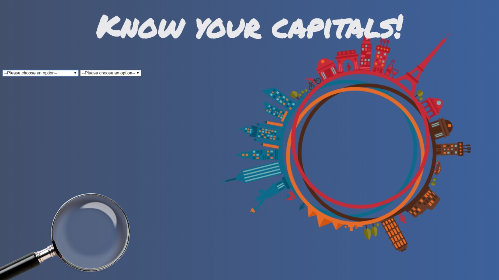
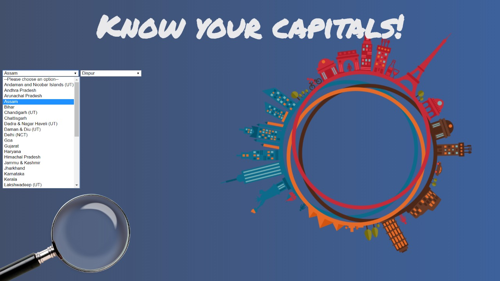

# Progate Week of Learning Project - States and Capitals of India

### Description
On selecting a country from the drop-down menu, it's capital gets selected from the list of capitals. On selecting a capital from the 2nd drop-down menu, the state it belongs to is displayed.

### Technologies
The page is structured and designed using HTML and CSS. JavaScript is used to access DOM and add Event Listeners. Google font is used for the heading.

